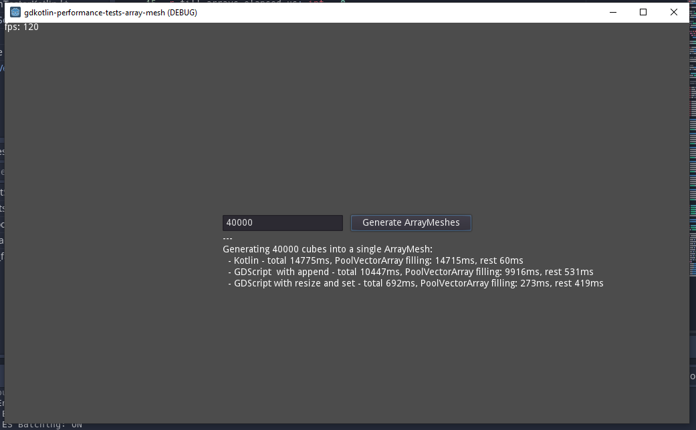

# Performance Test: Godot Kotlin's ArrayMesh bottleneck
[Godot Kotlin 0.3.3-3.4.2](https://github.com/utopia-rise/godot-kotlin-jvm/releases/tag/0.3.3-3.4.2) project, 
that generates the same mesh once via GDScript and once through the Kotlin bindings of 
[Godot Kotlin](https://github.com/utopia-rise/godot-kotlin-jvm/) to test performance.

